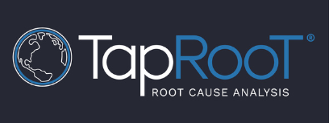
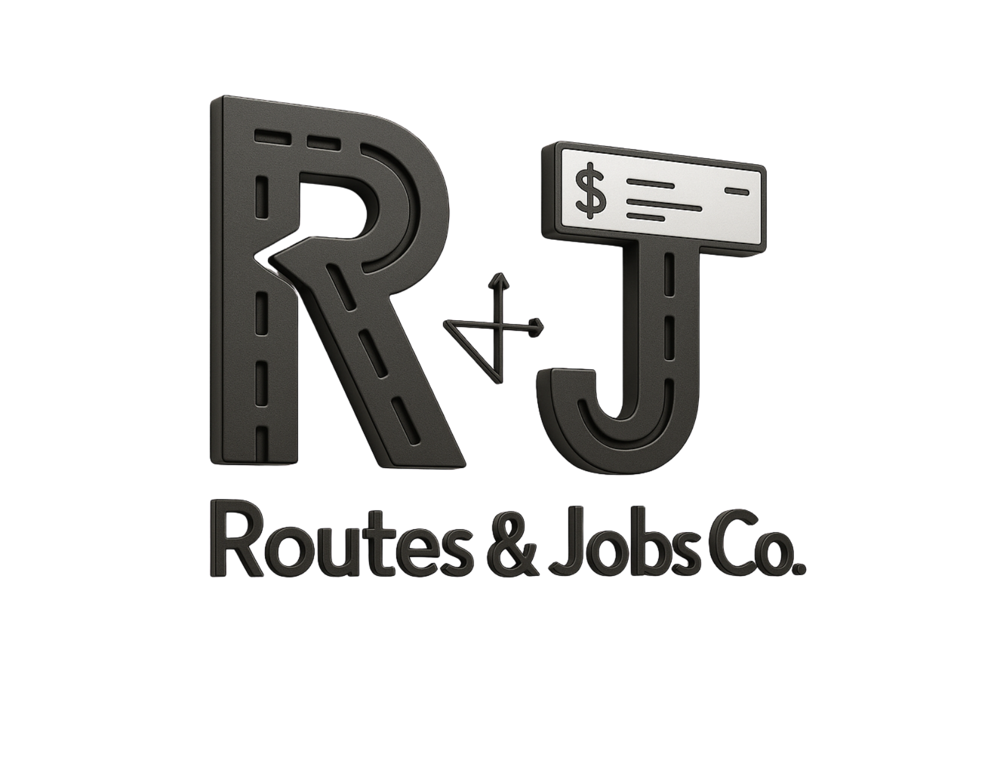
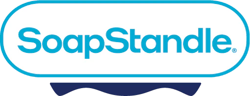

# hello world 👋🏾

iam DJ, a technologist, educator, and musician.

Feel free to reach out or check out any of these sample projects from my notes & research and the occasional game jam. 

My real production work over my career is largely proprietary, but you can find out more about those roles in PDF format @ [https://resume.dij.io](https://resume.dij.io) or in text @ [/resume](/resume)

## My LN Addresses: 
⚡ [dij@strike.me](https://strike.me/dij/)
⚡ dbang@zbd.gg

### Current Projects:

[Wattville](https://github.com/mrjones91/wattville) Supercharging Small-town TN with Eco-Friendly Data Centers 🛠️

⚙️🎮 Building Games and Bitcoin Software with C/C++/Zig

### Proof of Work:

👨🏾‍🏫 [Computer Science Educator](https://dij.io/cs)

👨🏾‍💻 [Open Source Developer and Contributor](https://github.com/mrjones91)

🎷 [Saxophone Jones](https://dij.io/sax)

#### Work History:

    
    <!--  -->
    
    
    
    
    
    

##### My Former Students/Mentees Have Worked At:

 
    
    
    
    
    
     
    
    
    
    
    
    
    
    

<!--🦘 [Jumping Jones Party Rentals](./jumpingjones)-->

<link rel="stylesheet" href="./style.css"/>

### My Skills:
##### Backend, Systems Engineering, Game Development:

##### Bitcoin:

<!-- ##### Game Platforms:
 -->

##### Frontend:

##### Database:

##### UX/UI:

<!-- [About dij](https://www.dij.io) -->

### Contact Me

<table>
    <thead>
        <td>My Words</td>
        <td>Resumes</td>
    </thead>
    <tbody>
        <tr>
            <td>
                <a href="https://sidequests.onrender.com/Blog/Staff/DJ">Blog</a>
            </td>
            <td>
                <a href="https://resume.dij.io">resume.dij.io</a>
            </td>
        </tr>
        <tr>
            <td>
                <a href="https://www.youtube.com/@dij117">Youtube</a>
            </td>
            <td>
                <a href="https://github.com/mrjones91">Github</a>
            </td>
        </tr>
        <tr>
             <td>
                <a href="https://iris.to/npub1fr2qklncjgf63t933r7cewpkyt5rv5ceq68zzwqz9fm4c8a5wjwq3sfgkh">NOSTR</a>
                <!-- - npub: npub1fr2qklncjgf63t933r7cewpkyt5rv5ceq68zzwqz9fm4c8a5wjwq3sfgkh -->
            </td>
            <td>
                <a href="https://linkedin.com/in/djones20">LinkedIn</a>
            </td>
        </tr>
    </tbody>
</table>

<!--
**mrjones91/mrjones91** is a ✨ _special_ ✨ repository because its `README.md` (this file) appears on your GitHub profile.

Here are some ideas to get you started:

- 🔭 I’m currently working on ...
- 🌱 I’m currently learning ...
- 👯 I’m looking to collaborate on ...
- 🤔 I’m looking for help with ...
- 💬 Ask me about ...
- 📫 How to reach me: ...
- 😄 Pronouns: ...
- ⚡ Fun fact: ...
-->
